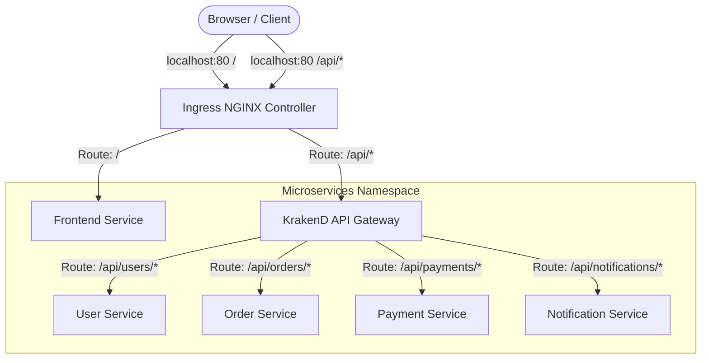

# Design Specification: Local Basic Kubernetes Flow (No DB / No Kafka)

**Date:** 2026-05-18  
**Author:** Antigravity AI  
**Status:** Under Review  

---

## 1. Goal Description
The objective of this design is to establish a verified, end-to-end routing flow in the local `k8s-demo` Kind cluster. Before deploying the full database and messaging systems (PostgreSQL and Kafka via Strimzi) or the CI/CD pipeline (Jenkins and Harbor), we need to ensure that the core network routing:
`Ingress (localhost) -> API Gateway (KrakenD) -> Backend Services (User, Order, Payment, Notification)`  
and  
`Ingress (localhost) -> Frontend Service (React Dashboard)`  
is fully operational and stable.

To do this, we will temporarily mock or bypass database/Kafka configurations in the microservices, fix the KrakenD port collision, integrate the frontend, and provide a local synchronization script to build and load images.

---

## 2. Architecture & Data Flow



---

## 3. Key Technical Specifications

### 3.1. Microservices Configuration Changes
To allow services to start without running database instances or Kafka clusters, we will exclude these Auto-Configurations in the Spring Boot `@SpringBootApplication` annotator across all 4 microservices.

**Target Files:**
* `services/user-service/src/main/java/com/demo/user/UserServiceApplication.java`
* `services/order-service/src/main/java/com/demo/order/OrderServiceApplication.java`
* `services/payment-service/src/main/java/com/demo/payment/PaymentServiceApplication.java`
* `services/notification-service/src/main/java/com/demo/notification/NotificationServiceApplication.java`

**Code Pattern:**
```java
@SpringBootApplication(exclude = {
    org.springframework.boot.autoconfigure.jdbc.DataSourceAutoConfiguration.class,
    org.springframework.boot.autoconfigure.orm.jpa.HibernateJpaAutoConfiguration.class,
    org.springframework.boot.autoconfigure.kafka.KafkaAutoConfiguration.class
})
```

---

### 3.2. KrakenD Environment Port Collision Fix
To resolve the `cannot parse 'port' as int: strconv.ParseInt: parsing "tcp://10.96.224.253:80"` issue, we will disable Kubernetes service links injection in the KrakenD deployment spec. This removes automatic TCP environment variables injection that overrides standard KrakenD config variables.

**Target File:** `gitops/base/krakend/deployment.yaml`

**Patch:**
```yaml
spec:
  template:
    spec:
      enableServiceLinks: false
```

---

### 3.3. Frontend Service GitOps Integration
The frontend service is in the local folder but not yet deployed by GitOps. We will add it to the ApplicationSet and configure its manifests.

**Target Files:**
1. **`gitops/apps/applicationset.yaml`**: Add `frontend` element to the list generator.
2. **`gitops/overlays/local/frontend/kustomization.yaml`** [NEW]: Create local overlay to configure the local build tag.
   ```yaml
   apiVersion: kustomize.config.k8s.io/v1beta1
   kind: Kustomization
   namespace: microservices
   resources:
     - ../../../base/frontend
   images:
     - name: ghcr.io/your-org/frontend
       newTag: "latest"
   ```

---

### 3.4. Local Build & Sync Script
We will provide a unified bash script `scripts/local-dev-sync.sh` to package, build, and load local Docker images into the Kind cluster, followed by triggering a local apply of configurations.

**Target File:** `scripts/local-dev-sync.sh` [NEW]

**Features:**
* Compiles and builds Docker images locally for the 5 services.
* Loads images into the Kind cluster: `kind load docker-image`.
* Runs a local apply if needed, though GitOps will automatically reconcile once pushed.

---

## 4. Verification Plan

### Manual Verification Steps
1. Push local changes to GitHub `thaothe37na/k8s-demo` (main branch).
2. Manually trigger Sync in ArgoCD for `applicationset` and individual services.
3. Verify all pods (`krakend`, `user-service`, `order-service`, `payment-service`, `notification-service`, `frontend`) are `Running` and healthy (`Actuator` liveness/readiness passing).
4. Access `http://localhost` on the MacBook to view the Frontend Dashboard.
5. Trigger manual refresh/pings on the UI and observe successful API calls going through KrakenD to the backend microservices.
